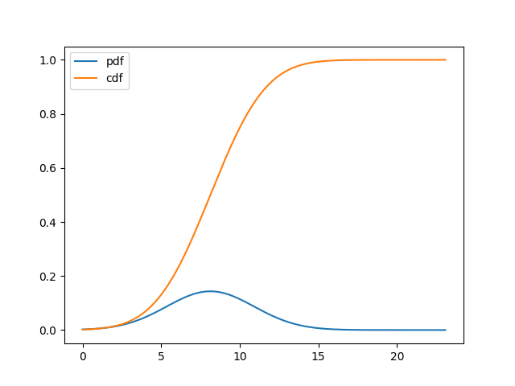

Name: Yiming Li

Student ID: 2813-8007-46

1a. Bacause each station could get the congestion information from each other, so that there is no station having a high backoff counter value, while others keep using the media.

1b. Because it will take more time for new sender to get packets. TCP's congestion window grows when RTT grows. For example, there are two connections C1 and C2. C1has a larger RTT which means fewer ACKs arrive; while C2 has a smaller RTT which mean more ACKs get comparing to C1 during the same time period. In this situation, C2 will reach the resource more often, which cause unfairness.

1c. The congestion is not uniform. Some are heavy while some are light. Using a single number to model congestion creates problem. Also, if an RTS keeps waiting for CTS, because of noise, it will let counter keep growing.

1d. We let all stations, which are communicating with the same recieving station, share a same bcakoff counter.

1e. The abuse of too many different backoff counters.

2a. Bufferbloat means the network throughput will reduce because of using too large size of buffer.

2b. Bufferbloat will cause low performance of network throughput and unsable of the neetwork. Packets will wait for a long time until be sent out.

2c. 100.2 Mbps

2d. 442ms

2e. 46.8 Mbps

2f. 175ms

2g. The worst case matters because worst cases have the largest influence of network throughput. 

2h. The average performance of latency., like measuring the average value of a time period.

3a. MacOS, about 5 years

3b. 269787

3c. 199428.85

3d. 22746919.71

3e. 3597

3f. Not like a Guassian distribution, more like a uniform distribution. The number of small files is almost the same as large files. If you see the graph in (3j), I think after logging the x axes, the distribution looks like a Guassian distribution.

3g. 170 bytes, occur 16551 times

3h. No

3i. Almost all these files are generated by Docker for git logs. So even if the size is not large, there are many of them.

3j. See the following graph. I change x axes to log scale.

3k. See the aboving graph. I change x axes to log scale.

3l. See the following graph.

3m. CCDF F(t) satisfies F(t) = Pr{X > t} ~ ct^(-a), t ->infinite, a and c are positive constants 

3n. Yes

3o. When t goes to infinite, log(y) goes to negative, which means y goes to zero. So it seems that it shows a heavey-tailed distribution

3p. Of course not! : )

