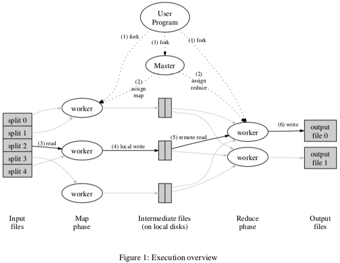

## Week 1


## Week 2


## Week 3


## Week 4


## Week 5


## Week 6


## Week 7


## Week 8


## Week 9


## Week 10

### w10p29-Dean04a-MapReduce


Q1. According to this paper, each mapper and reducer write their output into a seperate file. Why not write the output into the same file?

* For mappers, writting to one single file is uncessary, because master node will assign the output of each mapper to a reducer. In this step, we only concern the output of each mapper.
* For reducer, writting to a single file seems to make sense. But I think, if we do this in our system, we have to take care of data consistency. In the example of counting the number of occurrences in documents, if reducers writting to one single file, we need to deal with read-write conflict, which will make our system more complex.

Q2. The paper mentions if the master node fails, we will redo the work. Is there any other better way to deal with this?

* Maybe using a monitor node is a good idea. Master node keeps recoding checkpoints. And if monitor node finds master is down, it will recover master with checkpoints.
* Maybe we can design an algorithm to elect a new master node of running nodes.
* I think there is not a 100% reliable way to avoid master failure.


#### Abstract && Introduction

1. Mapreduce: a programming model and an associated implementation for processing and generating large data sets.
   * Map: process a {key, value} pair to generate a **set** of intermediate {key, value} pairs
   * Reduce: merge **all** intermediate values assocaited with the same intermediate key (to a smaller set)
2. Programs with Mapreduce would automatically parallelized and executed on a large cluster of machines.
3. This paper desigend Mapreduce(a new abstraction) to parallelize the computation, distrubute the data, and handle failure conspire
4. The idea come from the map and reduce primitives in Lisp


#### Programming Model

1. The computation of Mapreduce takes a set of input {key, value} pairs, and produces a set of output {key, value} pairs.
2. Map and Reduce functions are written by users.

##### Example

counting the number of occurences of each word in a large collection of documents

```C++
void map(string key, string value){
  // key: document name
  // value: document contents
  for(each_word in value){
    emit_intermediate(w, "1"); // {key, value} = {w, "1"}, 1 means one time
  }
}

int reduce(string key, iterator values){
  // key: a word
  // values: a list of counts
  int result = 0;
  for(each_v in values){
    result += to_int(v);
  }
  return result; // the number of occurences of a word
}
```

##### Types

Conceptually, the map and reduce functions supplied by the user have associated types:

map	{k1, v1}         —> list(k2, v2)

reduce    {k2, list(v2)} —> list(v2)

#### Implementation



输入被分成好多份，map按照一定规则给workers；workers生成中间pairs，写在存储设备上；reduce读这些pairs，整合相同的key，输出。User只需要编写Map和Reduce的代码。Steps:

* split the input files into M pieces
* 


#### Refinements

